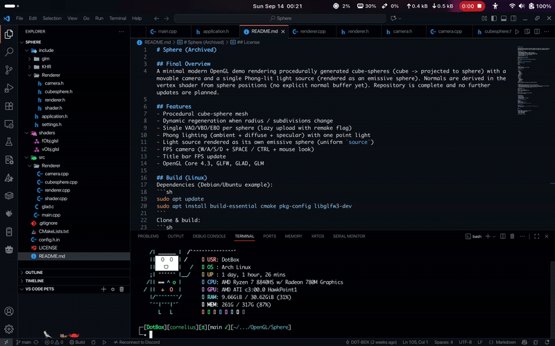

# Sphere (Archived)

## Final Overview
A minimal modern OpenGL demo rendering procedurally generated cube-spheres (cube -> projected to sphere) with a movable camera and a single Phong-lit light source (rendered as an emissive sphere). Normals are derived in the vertex shader from sphere positions (no explicit normal buffer yet). Repository is complete and no further updates are planned.



## Features
- Procedural cube-sphere mesh 
- Dynamic regeneration when radius / subdivisions change
- Single VAO/VBO/EBO per sphere (lazy upload with remake flag)
- Phong lighting (ambient + diffuse + specular) with one point light
- Light source rendered as its own emissive sphere (uniform `source`)
- FPS camera (W/A/S/D + SPACE / CTRL + mouse look)
- Title bar FPS update
- OpenGL Core 4.3, GLFW, GLAD, GLM

## Build (Linux)
Dependencies (Debian/Ubuntu example):
```sh
sudo apt update
sudo apt install build-essential cmake pkg-config libglfw3-dev
```
Clone & build:
```sh
git clone https://github.com/D0T-B0X/Sphere.git
cd Sphere
mkdir build && cd build
cmake ..
make -j
./Sphere
```

## Controls
- Move: W / A / S / D
- Vertical: SPACE (up), LEFT CTRL (down)
- Mouse: look (locked)
- ESC: quit

## Project Layout
```
include/
  Renderer/
    camera.h
    shader.h
    cubesphere.h
    renderer.h
  settings.h
  application.h
shaders/
  vObj.glsl
  fObj.glsl
src/
  main.cpp
  Renderer/
    renderer.cpp
    cubesphere.cpp
    shader.cpp
    camera.cpp
  glad.c
build/ (generated)
config.h.in -> generates build/config.h with absolute shader paths
```

## Rendering Flow
1. App constructs persistent Sphere objects (light + geometry spheres).
2. Renderer lazily uploads mesh data if `mesh.VAO == 0` or `remake == true`.
3. Per-frame: camera matrices set, light + view uniforms updated, non-light spheres drawn, then light sphere.
4. Vertex shader derives world position + per-vertex normal (from position direction).
5. Fragment shader performs Phong lighting unless `source == true`.

## Key Shaders
Vertex (positions only):
```glsl
vec4 wp = model * vec4(aPos,1.0);
vNormal = normalize(mat3(model) * aPos);
```
Fragment (Phong):
```
ambient + diffuse + specular (single point light)
source branch: solid emissive
```

## Limitations
- No UVs or textures
- No normal buffer
- Single light source
- No error HUD / ImGui
- No gamma correction / HDR / shadows
- No wireframe toggle

## How to Add Another Sphere
```cpp
Sphere rock;
rock.Name = "Rock";
rock.Color = {0.4f,0.6f,1.0f};
rock.setRadius(0.5f);
renderer.drawSphere(rock, {1.2f, 0.0f, 0.0f});
```

## Changing Detail
```cpp
coral.setSubdivisions(32); // marks remake=true -> reupload next frame
coral.setRadius(1.5f);
```

## License
MIT

## Final Status
Archived / read-only. Educational reference for:
- Basic procedural mesh generation
- Minimal shader pipeline
- Camera + input handling
- Simple Phong lighting

Enjoy exploring or forking.